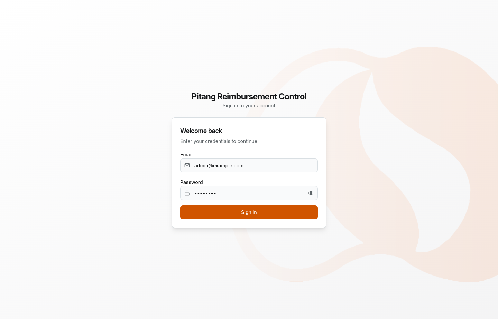

<div align="center">
  
  <h1 align="center">Sistema de Controle de Reembolsos</h1>
</div>

Aplicação fullstack de gestão de reembolsos — colaboradores enviam despesas,
gestores aprovam/rejeitam, financeiro marca como pago e admins gerenciam
usuários e categorias.

## Stack

| Camada   | Tecnologia                                               |
| -------- | -------------------------------------------------------- |
| Backend  | Express 5 + Prisma 7 + SQLite (libsql) + Zod             |
| Frontend | React 19 + TanStack Router + Shadcn UI + Tailwind        |
| Runtime  | Bun (gerenciador de pacotes + runtime)                   |
| Autent.  | JWT (jsonwebtoken) + bcryptjs                            |
| Testes   | bun:test + supertest (BE) / jsdom + testing-library (FE) |

## Início Rápido

**Pré-requisitos:** [Bun](https://bun.com) >= 1.3 **ou** [Docker](https://docker.com)

### Com Docker (recomendado para testar)

```bash
docker compose up --build
```

- Backend: http://localhost:3000
- Frontend: http://localhost:5173
- Hot-reload ativo (alterações em `src/` refletem automaticamente)
- Banco SQLite e uploads persistem em volumes Docker

### Com Bun (desenvolvimento local)

```bash
# 1. Instalar dependências
bun install

# 2. Configurar variáveis de ambiente do backend
cp packages/backend/.env-example packages/backend/.env

# 3. Criar banco de dados e rodar migrations
bun run --cwd packages/backend prisma:migrate
bun run --cwd packages/backend prisma:generate

# 4. Popular o banco (usuários de teste + categorias)
bun run --cwd packages/backend prisma:seed

# 5. Iniciar backend (http://localhost:3000)
bun run --cwd packages/backend dev

# 6. Iniciar frontend (http://localhost:5173)
bun run --cwd packages/frontend dev
```

### Usuários do Seed

| Perfil      | Email             | Senha     |
| ----------- | ----------------- | --------- |
| ADMIN       | admin@example.com | admin123  |
| COLABORADOR | employee@test.com | secret123 |
| GESTOR      | manager@test.com  | secret123 |
| FINANCEIRO  | finance@test.com  | secret123 |

Para alterar as credenciais, edite as variáveis no `.env` (`ADMIN_EMAIL`,
`ADMIN_PASSWORD`, `EMPLOYEE_PASSWORD`, `MANAGER_PASSWORD`, `FINANCE_PASSWORD`)
e execute `prisma:seed` novamente.

## Comandos

| O que           | Comando (da raiz)                                |
| --------------- | ------------------------------------------------ |
| Backend dev     | `bun run --cwd packages/backend dev`             |
| Backend test    | `bun run --cwd packages/backend test`            |
| Backend lint    | `bun run --cwd packages/backend lint`            |
| Frontend dev    | `bun run --cwd packages/frontend dev`            |
| Frontend build  | `bun run --cwd packages/frontend build`          |
| Frontend test   | `bun run --cwd packages/frontend test`           |
| Frontend lint   | `bun run --cwd packages/frontend lint`           |
| Prisma migrate  | `bun run --cwd packages/backend prisma:migrate`  |
| Prisma generate | `bun run --cwd packages/backend prisma:generate` |
| Prisma seed     | `bun run --cwd packages/backend prisma:seed`     |
| Prisma studio   | `bun run --cwd packages/backend prisma:studio`   |
| Root lint       | `bun run lint`                                   |
| Root format     | `bun run format`                                 |
| Docker up       | `docker compose up --build`                      |
| Docker down     | `docker compose down`                            |
| Docker rebuild  | `docker compose up --build --force-recreate`     |

## Arquitetura

```
packages/backend/
  src/
    index.ts                    Ponto de entrada (inicia o servidor)
    app.ts                      App Express (exportada para supertest)
      controllers/                Handlers (auth, user, category, reimbursement, attachment)
      routes/                     Rotas
      schemas/                    Schemas de validação Zod
      policies/                   Regras de permissão por perfil (reimbursement.policy.ts)
      middlewares/                Auth JWT, verificação de role, validação, tratamento de erros
      lib/                        Cliente Prisma, env vars, upload, errors (AppError)
    prisma/
      schema.prisma               Modelo de dados (User, Category, Reimbursement, Attachment, History)
      seed.ts                     Popula usuários + categorias + reembolso de exemplo
    tests/                        Testes de integração (68 testes, 5 arquivos)

packages/frontend/
  src/
    main.tsx                    Ponto de entrada
    routes/                     Rotas baseadas em arquivos (_authenticated.tsx, dashboard, reimbursements, users, categories)
      components/                 Componentes por domínio: auth/, layout/, reimbursements/, categories/, shared/, ui/
      contexts/                   AuthContext (JWT em cookie, validação /me)
      hooks/                      use-permissions.ts, use-breadcrumb.ts
      lib/                        api.ts (wrapper Fetch com redirect 401)
      services/                   Funções de serviço da API
      types/                      Tipos e constantes compartilhados
    tests/                        41 testes de componentes/formulários/permissões (10 arquivos)
```

## Endpoints da API

| Método | Caminho                                         | Perfil      | Descrição                       |
| ------ | ----------------------------------------------- | ----------- | ------------------------------- |
| POST   | `/auth/login`                                   | Público     | Login, retorna JWT              |
| GET    | `/auth/me`                                      | Autenticado | Dados do usuário logado         |
| POST   | `/users`                                        | ADMIN       | Criar usuário                   |
| GET    | `/users`                                        | ADMIN       | Listar usuários (paginado)      |
| POST   | `/categories`                                   | ADMIN       | Criar categoria                 |
| PUT    | `/categories/:id`                               | ADMIN       | Atualizar categoria             |
| GET    | `/categories`                                   | Autenticado | Listar categorias               |
| POST   | `/reimbursements`                               | Autenticado | Criar reembolso                 |
| GET    | `/reimbursements`                               | Autenticado | Listar (filtrado por perfil)    |
| GET    | `/reimbursements/stats`                         | Autenticado | Estatísticas do dashboard       |
| GET    | `/reimbursements/:id`                           | Autenticado | Buscar por ID                   |
| PUT    | `/reimbursements/:id`                           | Autenticado | Editar (DRAFT próprio)          |
| POST   | `/reimbursements/:id/submit`                    | COLABORADOR | Enviar para aprovação           |
| POST   | `/reimbursements/:id/approve`                   | GESTOR      | Aprovar                         |
| POST   | `/reimbursements/:id/reject`                    | GESTOR      | Rejeitar (justificativa obrig.) |
| POST   | `/reimbursements/:id/pay`                       | FINANCEIRO  | Marcar como pago                |
| POST   | `/reimbursements/:id/cancel`                    | COLABORADOR | Cancelar próprio                |
| GET    | `/reimbursements/:id/history`                   | Autenticado | Histórico de ações              |
| GET    | `/reimbursements/:id/attachments`               | Autenticado | Listar anexos                   |
| POST   | `/reimbursements/:id/attachments`               | Autenticado | Fazer upload de arquivo         |
| GET    | `/reimbursements/:id/attachments/:attachmentId` | Autenticado | Baixar arquivo                  |

## Máquina de Estados

```
RASCUNHO ──enviar──▶ ENVIADO ──aprovar──▶ APROVADO ──pagar──▶ PAGO
    │                   │
    └─cancelar──┐       ├──rejeitar─▶ REJEITADO
                │       │
                │       └─cancelar──┐
                ▼                   ▼
              CANCELADO ◀───────────┘
```

Toda transição gera um registro de histórico (ação, usuário, observação, data).

## Regras de Negócio

- **COLABORADOR**: criar, editar RASCUNHO próprio, enviar, cancelar RASCUNHO/ENVIADO próprio, ver seus reembolsos, anexar arquivos
- **GESTOR**: ver apenas ENVIADOS, aprovar, rejeitar (com justificativa obrigatória)
- **FINANCEIRO**: ver apenas APROVADOS, marcar como PAGO
- **ADMIN**: gerenciar usuários, gerenciar categorias, ver qualquer reembolso por ID
- **Validações**: valor > 0, categoria deve estar ativa, data futura bloqueada, justificativa obrigatória na rejeição
- **Ordenação e paginação**: `?page=1&limit=10&sort=createdAt&order=desc` em `/reimbursements` e `/users`
- **Filtros**: `?status=DRAFT&categoryId=xyz` (status disponíveis variam por perfil)

## Testes

```bash
# Backend — 68 testes de integração
bun run --cwd packages/backend test

# Frontend — 41 testes de componentes/formulários/permissões
bun run --cwd packages/frontend test

# Rodar um único arquivo de teste do backend
bun run --cwd packages/backend test tests/auth.test.ts
```

Os testes do backend compartilham o banco de desenvolvimento — cada teste limpa e
recria o admin. Os testes do frontend rodam com jsdom usando scripts de preload
para globais do DOM e helpers do React.

## Postman

Collection disponível em `postman/pitang-reimbursement-challenge.postman_collection.json`
com 33 requisições cobrindo todos os endpoints. As variáveis de token e IDs são
auto-populadas via scripts de teste ao executar os logins e o ciclo completo.
